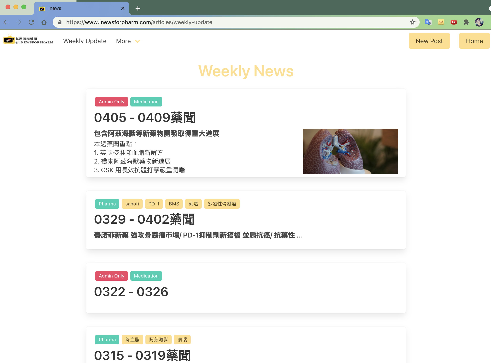
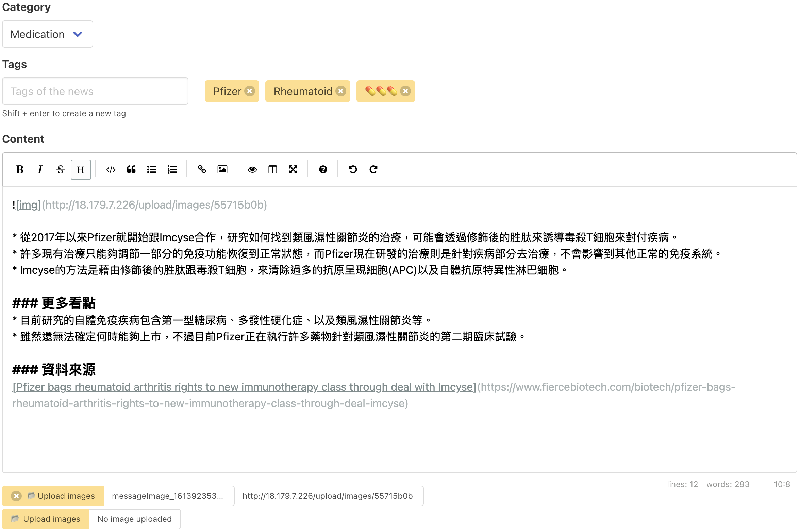

# article-sharing-website
An article sharing website developed by Go.

Here is a live demo: [inews](https://www.inewsforpharm.com/) (hosting on AWS EC2 with Load Balancer, Route 53, SES, Certificate Manager.)

## Overview
This project does not rely on any frontend framework, so it is a good entry point for backend engineers who want to build a whole website. With basic knowledge of JavaScript, You can start developing!

I choose [gin](https://github.com/gin-gonic/gin) as the backend web framework for its simplicity and high performance (it is also the most popular framework in Go, see [Top Go Web Frameworks](https://github.com/mingrammer/go-web-framework-stars)).

For database ORM, I choose [gorm](https://github.com/go-gorm/gorm). It is a full-featured ORM with great community support and [easy to follow documentation](https://gorm.io/docs/).
Besides, if you choose `sqlite` as the database driver, then you can get rid of the setting database burden (the data will be stored in a file `tmp.db` in the root of project) and focus on the backend development.

The admin users are created by the following mechanism:
1. Write down their emails in `config.yml`
2. Setup web server
3. Register with these corresponding emails on the website

If you are a novice to the database with no idea about the many-to-many relationship, the `databases/bookmark.go` is a good example. I utilize many-to-many relationship to implement features such as searching articles with tags and bookmarking articles.

## Setup
The credentials are stored in `config.yml`. Some of them are not yet implemented, but the most important fields are `app.httpPort`, `app.httpsPort`, `database`, and `admin.email`.  If set `database.driver` to `sqlite`, then `database.host` and `database.port` can be ignored.

There are some environment variables that can be overwritten (inside `config/config.go`). Environment variables have a `WEB_` prefix. You might want to use some of them: `WEB_APP_HTTP_PORT`, `WEB_APP_HTTPS_PORT`, `WEB_DB_PORT`, and `WEB_DB_HOST`.

To send reset password emails, see the **Others** section.

#### Local
```bash
# Set the env values if needed
# export WEB_APP_HTTP_PORT=8080
# export WEB_APP_HTTPS_PORT=8443
# export WEB_DB_PORT=3306
# export WEB_DB_HOST=127.0.0.1
go run cmd/main.go
```

#### Docker
1. Build
* Development
```bash
docker build . --target builder -t cwhuang29/article-sharing-website:dev
```
* Production
```bash
docker build . -t cwhuang29/article-sharing-website:prod
```

2. Run
* Database
```bash
docker run -d \
    --name db \
    -e MYSQL_DATABASE=inews \
    -e MYSQL_ROOT_PASSWORD=a1234567 \
    -e MYSQL_USER=user01 \
    -e MYSQL_PASSWORD=a1234567 \
    mysql:5.7.32 \
    mysqld --character-set-server=utf8mb4 --collation-server=utf8mb4_unicode_ci
```
* Web server
```bash
docker run -d \
    --name web \
    --link db:db \
    -e WEB_APP_HTTP_PORT=80 \
    -e WEB_APP_HTTPS_PORT=443 \
    -e WEB_DB_PORT=3306 \
    -e WEB_DB_HOST=db \
    -e WEB_APP_URL=https://example.com \
    -e WEB_EMAIL_SENDER=<sender email address> \
    -e WEB_EMAIL_REGION=us-east-1
    -p 80:80 \
    -p 443:443 \
    cwhuang29/article-sharing-website:prod
```

## Others
#### Sending emails via AWS SES
1. Fill in settings in the `email` section in `config.yml`. Sender email address and region can be overwritten by env `WEB_EMAIL_SENDER` and `WEB_EMAIL_REGION` respectively.
2. `app.url` is mandatory cause the reset password link is based on this value (can be overwritten by`WEB_APP_URL`)
3. `email.numPerDay` and `email.numPerSec` in `config.yml`, which represent maximum send quota/rate, is the restrictions imposed by AWS.
4. AWS retrieves credentials under `~/.aws/credentials`.  Copy credentials from the AWS web console and create this file with the following content:
```bash
[default]
aws_access_key_id=
aws_secret_access_key=
```
5. Verify domains and (sender) email addresses on AWS console (see [here](https://docs.aws.amazon.com/ses/latest/DeveloperGuide/verify-email-addresses.html)).
6. Submit a request to AWS to increase sending limits and move your account out of the Amazon SES sandbox (see [here](https://docs.aws.amazon.com/ses/latest/DeveloperGuide/manage-sending-quotas.html)).

#### Connect to database
Instead of connecting to the database container (which name is `db` in my case) directly, we can run another MySQL container and query the database container.
```
docker run -it --rm --link db:db mysql:5.7.32 mysql -hdb -u user01 -pa1234567 inews
```

#### Dump database
To dump the database, run
```bash
docker exec -it db mysqldump -u user01 -pa1234567 inews > data-`date +"%Y-%m-%d-%H-%M-%S"`.sql
```

There is some warning messages while dumping out data. To avoid warning, you can run:
```
docker exec -it db mysqldump -u user01 -pa1234567 --no-tablespaces inews <tables, seperated by space> \
    grep -v "Using a password on the command line interface can be insecure" > data-`date +"%Y-%m-%d-%H-%M-%S"`.sql
```

#### SSL/TLS Certificates
Since all cookies are sent only with encrypted requests and responses, you may want to get certificates for localhost. Here is a good example: [How to get HTTPS working on your local development environment in 5 minutes](https://www.freecodecamp.org/news/how-to-get-https-working-on-your-local-development-environment-in-5-minutes-7af615770eec/).
After setting up the certificates, copy `server.crt` and `server.key` to the `certs/` folder (in the root of the project), and then connect to URL `https://localhost`.

#### Install environment on AWS
If you want to host the website on AWS EC2, run the following script to install Docker and MySQL
```bash
# Install Docker
sudo yum update -y
sudo amazon-linux-extras install docker
sudo service docker start
sudo usermod -a -G docker ec2-user
# Logout and log back in

# Install MySQL
sudo yum -y install mysql
```

## TODO
- [x]  Register
- [x]  Logout
- [x]  Modify articles
- [x]  Delete articles
- [x]  Optimize Docker builds
- [x]  Pagination
- [x]  Middleware
- [x]  CSRF token
- [x]  Support HTTPS
- [x]  Add an "only administrators can view" option
- [x]  Outline and cover photo for the overview page
- [x]  Reset password
- [x]  Login Throttling
- [x]  Tag-based search
- [x]  Preserve fetched data while going to the previous page
- [x]  Save (bookmark) button
- [x]  Like button
- [ ]  Logger
- [ ]  Admin overview page (e.g. show statistics)
- [x]  Security issues about uploading files
- [ ]  Support CLI
- [x]  Integrate AWS SES to send emails

## Demo
### Feature - article list

### Feature - browse

### Feature - edit

