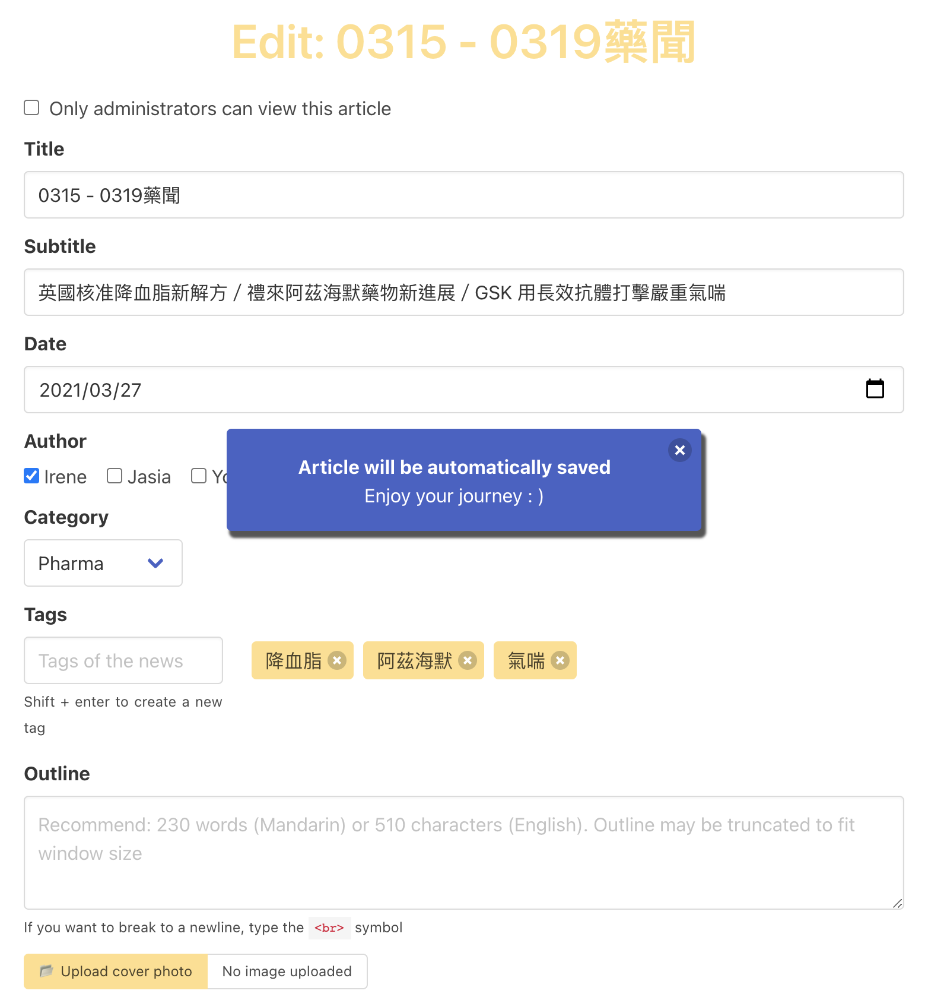

# article-sharing-website
An article sharing website developed by Go.

Here is a live demo: [inews](https://www.inewsforpharm.com/) (hosting on AWS EC2 with Load Balancer, Route 53, Certificate Manager.)

## Overview
This project does not rely on any frontend framework, so it is a good entry point for backend engineers who want to build a whole website. With basic knowledge of JavaScript and CSS, You can start developing!

I choose [gin](https://github.com/gin-gonic/gin) as the backend web framework for its simplicity and high performance (it is also the most popular framework in Go, see [Top Go Web Frameworks](https://github.com/mingrammer/go-web-framework-stars)).

For database ORM, I choose [gorm](https://github.com/go-gorm/gorm). It is a full-featured ORM with great community support and [easy to follow documentation](https://gorm.io/docs/).
Besides, if you choose `sqlite` as the database driver, then you can get rid of the setting database burden (the data will be stored in a file `tmp.db` in the root of project) and focus on the backend development.

The admin users are created by the following mechanism:
1. Write down their emails in `config.yml`
2. Setup web server
3. Register with these corresponding emails on the website

## Setup
The credentials are stored in `config.yml`. Some of them are not yet implemented, but the most important fields are `app.port`, `database`, and `admin.email`.  If set `database.driver` to `sqlite`, then `database.host` and `database.port` can be ignored.

There are three environment variables that can be overwritten, which are `APP_PORT`, `DB_PORT`, and `DB_HOST`.

#### Local
```bash
# Set the env values if needed
# export APP_PORT=8080
# export DB_PORT=3306
# export DB_HOST=127.0.0.1
go run cmd/main.go
```

#### Docker
1. Build
* Development
```bash
docker build . --target builder -t cwhuang29/article-sharing-website:dev
```
* Production
```bash
docker build . -t cwhuang29/article-sharing-website:prod
```
2. Run
```bash
docker run -d \
    --name db \
    -e MYSQL_DATABASE=inews \
    -e MYSQL_ROOT_PASSWORD=a1234567 \
    -e MYSQL_USER=user01 \
    -e MYSQL_PASSWORD=a1234567 \
    mysql:5.7.32 \
    mysqld --character-set-server=utf8mb4 --collation-server=utf8mb4_unicode_ci

docker run -d \
    --name web \
    --link db:db \
    -e APP_PORT=80 \
    -e DB_PORT=3306 \
    -e DB_HOST=db \
    -p 80:80 \
    cwhuang29/article-sharing-website:prod
```

### Others
To dump the database, run
```bash
docker exec -it db mysqldump -u user01 -pa1234567 inews > data.sql
```

If you want to host the website on AWS EC2, run the following script to install Docker and MySQL
```bash
# Install Docker
sudo yum update -y
sudo amazon-linux-extras install docker
sudo service docker start
sudo usermod -a -G docker ec2-user
# Logout and log back in

# Install MySQL
sudo yum -y install mysql
```

## TODO
- [x]  Register
- [x]  Logout
- [x]  Modify articles
- [x]  Delete articles
- [x]  Optimize Docker builds
- [x]  Pagination
- [x]  Middleware
- [x]  CSRF token
- [ ]  Logger
- [ ]  Reset password
- [ ]  Support Google login
- [ ]  Login Throttling
- [ ]  Search articles based on tags
- [ ]  Like/Save buttons
- [ ]  Admin overview page (e.g. show statistics)
- [ ]  Preview feature (before submitting the article)
- [x]  Security issues about uploading files
- [ ]  Support CLI
- [ ]  Integrate AWS SES to send emails

## Demo
### Feature - article list

### Feature - browse

### Feature - edit

